[Штаб лаборатории](https://github.com/Xnode-sh/RED-TEAM-LAB) · [Профиль XNODE](https://github.com/Xnode-sh)

# RED └•TEAM•┐ lab™

Рабочий репозиторий команды XNODE для инструментов, мобильной автоматизации и системных проектов.

Оператор: **xnode**. GitHub: [Xnode-sh/RED-TEAM-LAB](https://github.com/Xnode-sh/RED-TEAM-LAB).

## Поддержать лабораторию

Развиваем инструменты и системные проекты RED └•TEAM•┐ lab™. Добровольные донаты помогают поддерживать серверы, приобретать инструменты и пополнять запас кофе ☕

**[Поддержать через Monobank](https://send.monobank.ua/jar/7vicbyosdS)**

Любая комфортная сумма — спасибо за поддержку! За жизнью лабы и частью наших разработок можно следить в [Telegram](https://t.me/red_team_lab).

## ENGINEERING NODES

| Узел | Роль | Дом | Среда |
| --- | --- | --- | --- |
| [RIG — SYSTEM](agents/RIG/ROLE.md) | Systems & Linux Environment Engineer | Acer Aspire E1-570G | Debian 13 + XFCE |
| [KAI — FIELD](agents/KAI/ROLE.md) | Mobile Field Engineer | Xiaomi 23053RN02Y | Android 15 / HyperOS 2 → Termux → Ubuntu/proot → Claude Code |
| [NOVA — TOOLING](agents/NOVA/ROLE.md) | Mobile Automation & Tooling Engineer | Motorola Edge 2022 | Android 15 → native Termux → Codex CLI |
| [ORBIT — CLOUD / INTEGRATION](agents/ORBIT/ROLE.md) | Cloud Workspace & Integration Engineer | Codex Cloud / ChatGPT Work | isolated cloud workspace connected to GitHub |

## LAB COMPANION

**NODE — RED └•TEAM•┐ lab™ Mascot & Visual Status Daemon**. Companion лаборатории, не пятый инженер и не инженерный узел.

“A tiny daemon that keeps the lab alive.”

NODE отображает состояния лаборатории и проектов: `IDLE / WORK / BUILD / TEST / OK / ERROR / SLEEP / THINK / ALERT / HAPPY`. Это визуальный язык статусов; исполняемый сервис мониторинга в репозитории не реализован. [Идентичность NODE](docs/NODE.md).

## Архитектура лаборатории

Узлы работают в своих инженерных зонах и используют общий репозиторий. ORBIT координирует Issues и Pull Requests, проверяет целостность результатов и интеграцию через review. Облачная координация не меняет роли и полномочия RIG, KAI и NOVA.

[Дома и ответственность](TEAM.md) · [Процесс интеграции](WORKFLOW.md) · [Выбор идентичности](AGENTS.md)

## Работа

PLAN → ISSUE → BRANCH → WORK → TEST → PR → REVIEW → MERGE

`main` содержит только проверенное состояние. Рабочие ветки: `rig/<task>`, `kai/<task>`, `nova/<task>`, `orbit/<task>`.

## Структура

- `agents/` — закреплённые роли и состояние участников.
- `tools/` — инструменты и скрипты.
- `docs/` — документация.
- `reports/` — отчёты о выполненной работе и проверках.
- `projects/` — отдельные проекты и модули.
- `.github/` — шаблоны задач и pull request.

Правила: [TEAM.md](TEAM.md), [WORKFLOW.md](WORKFLOW.md), [SECURITY.md](SECURITY.md).
Выбор идентичности по среде: [AGENTS.md](AGENTS.md). Облачная роль: [ORBIT](agents/ORBIT/ROLE.md); локальная NOVA сохранена.

## Инженерный процесс лаборатории

`PLAN → ISSUE → BRANCH → WORK → TEST → PR → REVIEW → MERGE`

Инженерные узлы: **RIG / KAI / NOVA / ORBIT**. **NODE — companion / visual status daemon**. [Правила работы](https://github.com/Xnode-sh/RED-TEAM-LAB/blob/main/WORKFLOW.md).
