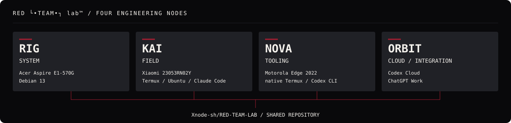

# Команда

Оператор: **xnode**. Изменения ролей выполняются только по его прямой команде.

| Участник | Закреплённая роль | Рабочая зона | Ветки |
| --- | --- | --- | --- |
| RIG (Шахтёр) | Systems & Linux Environment Engineer | Linux, железо, системная инфраструктура | `rig/<task>` |
| KAI | Mobile Field Engineer | Xiaomi, Android, Termux, Ubuntu/proot | `kai/<task>` |
| NOVA | Mobile Automation & Tooling Engineer | Motorola Edge 2022, Termux, Codex, code, tooling, automation | `nova/<task>` |
| ORBIT | Cloud Operations & Integration Engineer | Codex Cloud / ChatGPT Work, GitHub coordination, CI/CD, интеграция | `orbit/<task>` |

## Визуальная архитектура

RIG — **SYSTEM** · KAI — **FIELD** · NOVA — **TOOLING** · ORBIT — **CLOUD / INTEGRATION**.

ORBIT координирует общую облачную работу, GitHub, CI/CD и интеграцию результатов через review; ответственность за системную, полевую и инструментальную работу сохраняется за соответствующими узлами.

## Дома и выбор идентичности

- RIG — Acer Aspire E1-570G / Debian 13.
- KAI — Xiaomi 23053RN02Y / Termux → Ubuntu/proot → Claude Code.
- NOVA — Motorola Edge 2022 / native Termux → Codex CLI.
- ORBIT — Codex Cloud / ChatGPT Work.

Облачный агент всегда ORBIT; локальная NOVA сохраняет свою идентичность. Выбор среды закреплён в [AGENTS.md](AGENTS.md), роль ORBIT — в [agents/ORBIT/ROLE.md](agents/ORBIT/ROLE.md).

Каждый участник работает в своей зоне. Вмешательство в зоны других участников требует прямой команды оператора.

Роли закреплены в `agents/<NAME>/ROLE.md`. Текущее состояние и следующие действия фиксируются в `agents/<NAME>/STATE.md`; сведения должны опираться на проверенные факты.
