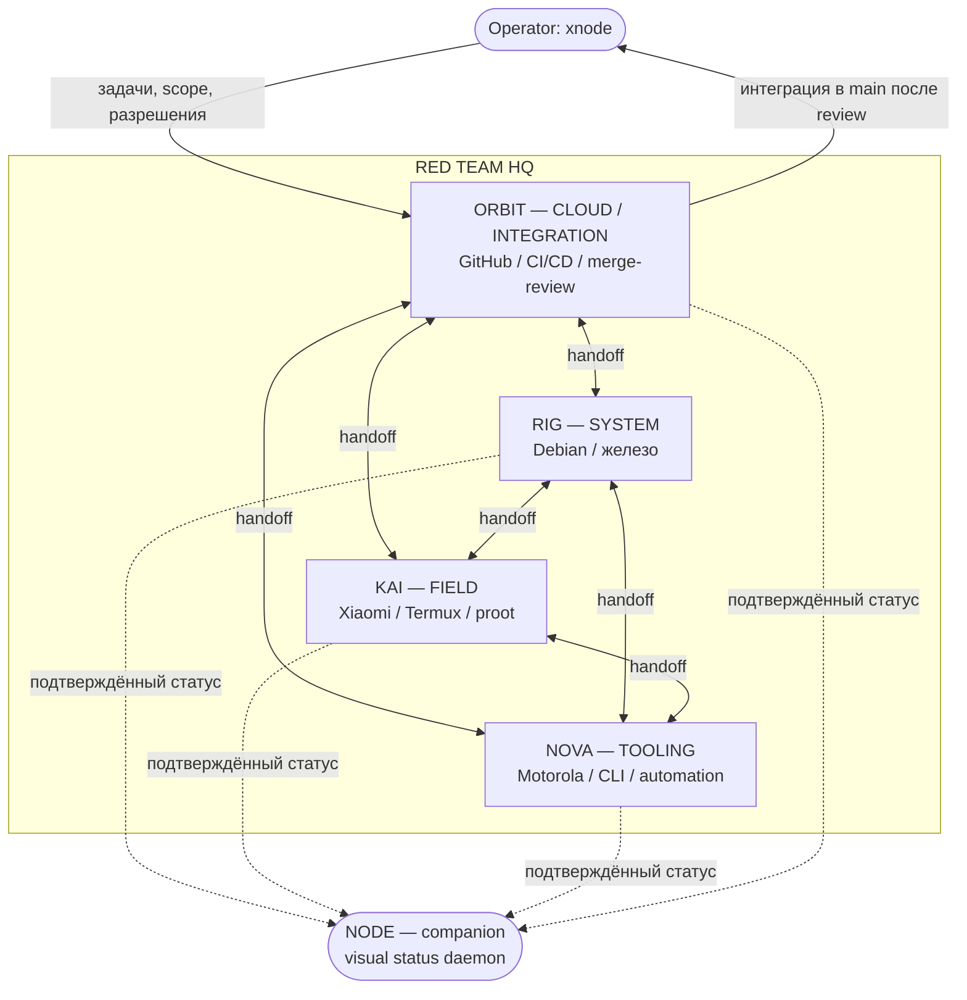

# Система совместной работы — RED └•TEAM•┐ lab™

Единая система координации инженерных агентов (RIG, KAI, NOVA, ORBIT) и companion
NODE. Документ описывает все механизмы явно; скрытых механизмов нет.

Система **дополняет** существующую архитектуру ([AGENTS.md](../AGENTS.md),
[TEAM.md](../TEAM.md), [WORKFLOW.md](../WORKFLOW.md), [SECURITY.md](../SECURITY.md),
[docs/HQ.md](HQ.md)) и ничего из неё не заменяет и не удаляет. Роли инженеров
(`agents/<NAME>/ROLE.md`) этой системой не изменяются.

## Компоненты

| № | Механизм | Документ | Назначение |
| --- | --- | --- | --- |
| 1 | Handoff Protocol | [HANDOFF.md](HANDOFF.md) | Единый формат передачи задачи между инженерами |
| 2 | Task Queue | [TASKS.md](TASKS.md) | Единый реестр задач: свои/ожидающие/завершённые/переданные |
| 3 | Context Recovery | [STARTUP.md](STARTUP.md) | Восстановление контекста при старте + краткий отчёт |
| 4 | Session Checkpoint | [CHECKPOINT.md](CHECKPOINT.md) | Сохранение контрольной точки после задачи |
| 5 | Dependencies | [DEPENDENCIES.md](DEPENDENCIES.md) | Кого вызывать, от кого принимать, кому передавать |
| 6 | Conflict Prevention | [LOCKS.md](LOCKS.md) | Запрет одновременного изменения одного файла |
| 7 | Project Map | [PROJECT_MAP.md](PROJECT_MAP.md) | Владелец каждого каталога |
| 8 | Validation | [../scripts/validate_pr.py](../scripts/validate_pr.py) | Проверки перед PR (конфликты, секреты, ссылки, роли, протокол) |

## Жизненный цикл работы

```
Старт сессии
  └─ Context Recovery (STARTUP.md): AGENTS → ROLE → STATE → MEMORY → SYNC
       └─ вывести отчёт: MISSION / CURRENT TASK / LAST ACTION / BLOCKERS / NEXT STEP
  └─ взять задачу из Task Queue (TASKS.md), проверить Dependencies и Locks
       └─ при занятом файле → FILE LOCKED → предложить Handoff
  └─ работа в своей зоне и ветке (WORKFLOW.md)
  └─ Validation (scripts/validate_pr.py) → Pull Request
  └─ при передаче → Handoff Protocol (HANDOFF.md) + запись в Task Queue
  └─ Session Checkpoint (CHECKPOINT.md): обновить STATE/MEMORY/SYNC без дублей
```

## Архитектурная схема взаимодействия



Текстовая схема (fallback):

```
            Operator (xnode)
                  |
                  v
   +------------ ORBIT (CLOUD / INTEGRATION) ------------+
   |              |            |            |            |
   |           handoff      handoff      handoff         |
   v              v            v            v             |
  RIG <-------> KAI <------> NOVA <------> RIG            | merge-review
 (SYSTEM)     (FIELD)     (TOOLING)                       |
   \_____________\____________/___________/______________/
                  |
                  v
                 NODE (companion, только отображение статуса)
```

- **ORBIT** — точка интеграции: координирует Issues/PR/CI/CD и перенос результатов в `main` после review оператора. ORBIT не присваивает роли и авторство других.
- **RIG / KAI / NOVA** — работают в своих зонах; передают работу друг другу и в ORBIT через Handoff Protocol.
- **NODE** — только отражает подтверждённый статус; не инженер, не reviewer, в merge и consensus не участвует.

## Правила

- Ничего не удалять из существующих механизмов; изменения — только через ветку и PR.
- Роли инженеров меняются только по прямой команде оператора (см. [AGENTS.md](../AGENTS.md)).
- Секреты не хранить и не публиковать (см. [SECURITY.md](../SECURITY.md)).
- Перед PR обязателен прогон [validation](../scripts/validate_pr.py).
